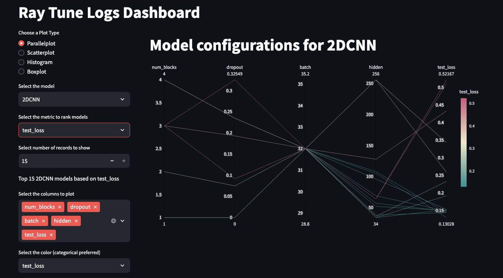

## 3. General info
Student: Francesca Paulin
Repo: https://github.com/FP-byte/MADS_EXAM-25_FP

# Installation

## Install rye as package manager
please note that rye might already be installed on your machine.
1. watch the [introduction video about rye](https://rye.astral.sh/guide/)
2. check if rye is already installed with `which rye`. If it returns a location, eg `/Users/user/.rye/shims/rye`, rye is installed.
3. else, install [rye](https://rye.astral.sh/) with `curl -sSf https://rye.astral.sh/get | bash`

run through the rye installer like this:
- platform linux: yes
- preferred package installer: uv
- Run a Python installed and managed by Rye
- which version of python should be used as default: 3.11
- should the installer add Rye to PATH via .profile? : y
- run in the cli: `source "$HOME/.rye/env"`

For windows this should be the same, except for the platform of course...

## install dependencies

To install the project dependencies:
`rye sync`

## Install CUDA for GPU 
For Windows: install NVIDIA drivers and Nvidia tools
Then add the following to your pyproject.toml:
```
[[tool.rye.sources]]
name = "pytorch"
url = "https://download.pytorch.org/whl/cu118"
```
This should download the CUDA version of pytorch the first time you sync.

#Now add torch to your setup
`rye add pytorch torchvision`

## Start your environment
In windows:
`source .venv/Scripts/activate`
In Linux or Mac:
`source .venv/bin/activate`


## The data
### Arrhythmia Dataset

- Number of Samples: 109446
- Number of Categories: 5
- Sampling Frequency: 125Hz
- Data Source: Physionet's MIT-BIH Arrhythmia Dataset
- Classes: ['N': 0, 'S': 1, 'V': 2, 'F': 3, 'Q': 4]
All the samples are cropped, downsampled and padded with zeroes if necessary to the fixed dimension of 187. There is a target column named "target".

You can find this in `data/heart_big_train.parq` and `data/heart_big_test.parq`.

Due to imbalance of the train dataset, the dataset has been rebalanced in two ways.
The process of resampling is described in the notebook `notebooks/05_Resampling.ipyb`

### Oversampling traing dataset oversampling
Semi balanced dataset is obtain by upsampeling the minority classes to the majority class, still keeping the unbalanced distribution.
The distribution is as follows:
0.0    72471
4.0    30938
2.0    27743
1.0    10761
3.0     3029

Fully balanced dataset is composed as follows:
Downsampling: 75% of the majority class (55.000) 
Upsampling: all the majority class have been upsampled to 55.000 samples

In both cases the upsampling did not introduce new data but just a repetition of samples.
The semi-sampled has been used for few training rounds and then replaced by the fully oversampled one.

### SMOTE dataset
Smote dataset consist of syntetic data obtained by creating new instances that are interpolated between existing instances of the minority class. It uses a k-nearest neighbors (k-NN) approach to find similar points and generates synthetic examples that are between those points.
Dataset contains 72.471 samples for each class.

## Weight rebalancing
I also tried reweighting for 2D CNN and Transformer models using sklearn class weight function.
class_weight ('balanced'): 'balanced': Automatically adjusts the weights inversely proportional to the class frequencies. This is useful when you have a highly imbalanced dataset. A dictionary where keys are the class labels and values are the corresponding weight values. If provided, it overrides the class_weight parameter.
The reweighting did not work well for all models, thus I did not test it further.

The traing of the models has been done on the original dataset and all three datasets.


## Exploration and hypothesis
In `notebooks/00_journal_explore-heart.ipynb` describes all the explorations of models and (manual) hypertunig steps.

## Models
The models are loaded to the notebooks and in the hypertuning from the file `src/models.py`
There are two notebooks with for manually hypertuning models, one for 1D models and one for 2D architectures. 

# Reporting
Please find the report in `report/MADS_report_FP.pdf`

# 1. Explore: models overview
My explorations (see src/models.py) incuded:
- CNN 2D + ResNet
- Transformer with CNN 2D
- Transformer + CNN 1D + Resnet
- Transformer + CNN 1D + Resnet + Squeeze and Excite (SE)
- Transformer + CNN 2D + ResNet
- Transformer + CNN 2D + ResNet + Squeeze and Excite (SE)
- CNN1D + ResNet
- CNN1D GRU + ResNet
- CNN1D + GRU+ ResNet + Multihead Attention

Additions tested:
- Dilated Convolutions: Increased receptive field by spacing out the kernel, capturing long-range dependencies.
- MaxPooling vs. GAP: MaxPooling captured peaks in time-series, while GAP aggregated features—each useful depending on the task.
- Packed Sequences: Improved efficiency by converting padded sequences into packed format, enabling RNNs to ignore padding.
- Seed:setting a random seed is crucial for reproducibility.

## 2 Manual and Ray hypertuning

Hypertuning of hybrid model 1D CNN + GRU: `hypertune_1DCNNGRU.py` file to hypertune the model with Ray. 
Hypertuning of hybrid model 2D CNN + Resnet: `hypertune_2DCNNResnet.py` file to hypertune the model with Ray. 
The files make use of basis settings from the class Hypertuner (hypertuner.py)


## Run the dashboard for Ray logs:


I created a simple dashboard to analyze the hypertuning logs (selects only the given number of top configurations the highest accuracy/recall).
Start your as described above then run:
```bash
cd dashboards # cd-ing into the correct folder
streamlit run dashboard_ray.py # executing the script
```

## Open the dashboard
If you run this on a VM, VScode should automatically forward your port on `:8501`. You can see this under the tab `Ports`, next to the tab for `Terminal`.

Locally, you can open `http://localhost:8501/` and you should see your dashboard!


