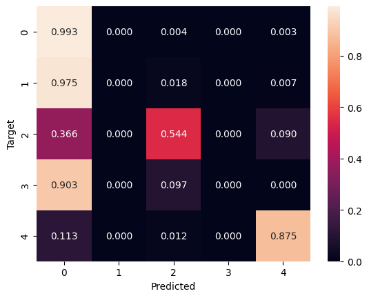
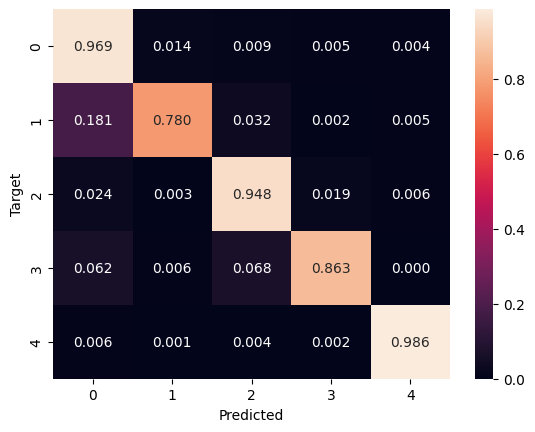
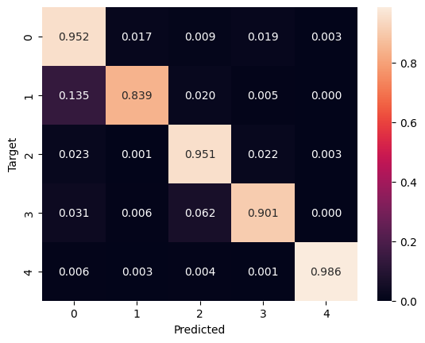
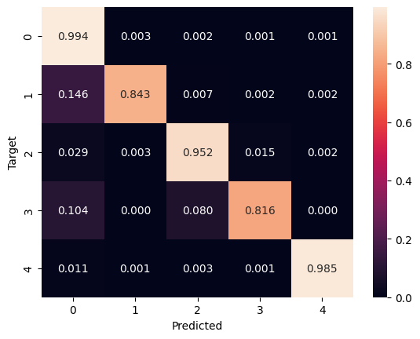

# Project Report - Master Informatics

-----------------------------------------------

### Author: Francesca Paulin 
### Studentnr: 1882135 
### Course: Machine learning course 
### Teacher: R. Grouls 
### Date: 04-02-2025 

Project repo: [https://github.com/FP-byte/MADS_EXAM-25_FP](https://github.com/FP-byte/MADS_EXAM-25_FP)

# Top Architectures Overview

### 1. 1D CNN with GRU and Resnetblock (1DCNNGRU)

**Architecture**:
A hybrid model architecture with a 1 dimentional convolutional network with resnet blocks and a GRU 
| **Layer Type**            |**Description**                                                                                                                       |
|----------------------|----------------------------------------------------------------------------------------------------------------------------------------------------|
| **ConvBlocks1D**         | 1D Convolution: kernel_size=3, stride=1, padding=1; followed by ReLU activation and BatchNorm1d                                                    |
| **ResNetBlocks1D**       | Residual Block: Two 1D Convolutions (kernel_size=3, stride=1, padding=1), followed by ReLU activation and BatchNorm1d. Includes a skip connection. |
| **MaxPool1d**             | Max Pooling: kernel_size=2, stride=2. Reduces the sequence length by half.                                                                         |
| **Linear**                | Linear Layer: Flattens the output of convolutions, transforming the features into a flatten vector.                                                |
| **GRU**                   | GRU Layer: input hidden units, input number of layers, batch_first=True, dropout for regularization                                                |
| **Dense Layers**          | GRU output (batch_size, hidden size) is flattened into a 1D vector (batch_size, hidden size).   2 Fully connected Layers: hidden size input features, hidden size output features with ReLu Activation, 5 output features (final classification).         |

### 2. 2D Convolutional Neural Network (CNN) with ResNet block
**Architecture**: The model is a 2 dimentional convolutional network with a Resnet block
| **Layer Type**     | **Description**                                                                                                                             |
|--------------------|---------------------------------------------------------------------------------------------------------------------------------------------|
| **Convolutions blocks**  | Conv2d block with given hidden size as input channel, hidden size output channels, kernel size 3x3, stride 1x1, padding 1x1, with ReLU activation and BatchNormalization   |
| **ResNetBlock2D**  | 2 Conv2d layers, hidden size input/output channels, kernel size 3x3, stride 1x1, padding 1x1   |
|                    | followed by ReLU activation and Batch Normalization 2D                 |
| **MaxPool2d**      | Identity layer (preserve the input ) followed by MaxPool 2D layer  Kernel size 2x2, stride 2x2   | 
| **Dense Layers**   | Flatten input tensor starting from the first dimension   
|                    | 2 Linear layers with input flattened features, hidden size output/input followed by ReLU activation with final 5 output classes          |

## HYPERTUNING SEARCHSPACE

The hyperparameters of the model were optimized using the following search space (top 10 models):

| **Model** | **Batch Size**  | **Hidden units GRU**   | **Hidden units CNN**   | **Number of Layers** | **Number of blocks** | **Dropout Rate** | **Factor (ReduceLROnPlateau)** |
|-----------|-----------------|------------------------|------------------------|----------------------|------------------|----------------------|--------------------------------|
| 1DCNNGRU  | [16, 32, 48, 60]| [32, 64, 128, 256, 512]| [32, 64, 128, 256, 512]  | [2, 3, 4]    | [1 - 5]              | [0.2, 0.3, 0.4]  | [0.1 - 0.4]                    | 
| 2DCNN     | [16, 32, 48]    |                        | [62 - 256]               | [2, 3, 4]    | [1 - 7]              | [0.1 - 0.4]      | [0.1 - 0.4]                   |

Best configurations for the two model (30 epochs) with a balanced oversambled traindata:
|  Model       |   iterations |   accuracy |   recallmacro |   batch |   hidden |   dropout |   num_layers |   num_blocks   |   factor |   gru_hidden | 
|-------------|-------------|-----------|--------------|--------|---------|----------|-------------|--------------|---------|-------------|
|  2DCNN    |           30 |     0.9888 |        0.9744 |      16 |      128 |       0.3 |            3 |            1 |      0.2 |        --    | 
|  1DCNNGRU |           28 |     0.9858 |        0.9593 |      32 |       64 |       0.4 |            2 |            5 |      0.2 |        256   |

Hyperparameter tuning started with manual exploration of parameters like the number of blocks and layers, followed by hypertuning using Ray Tune’s HypeOptSearch. This method probabilistically searches the space, using previous trial performance to predict optimal hyperparameters. During hypertunring additional factors like batch size, optimizer, scheduler and dataset were tested. These parameters not reported on the table for lack of space. Models were trained for 30 to 40 epochs with early stopping, as longer training did not improve accuracy on either the SMOTE or oversampled datasets.

## RESULTS, REFLECTIONS AND KEY LEARNINGS

The initial hypothesis was that 1D models, specifically GRU and 1D CNN, would be a better fit for the training set due to the sequential nature of the data. This hypothesis was confirmed: 1D models performed well, but a significant amount of experimentation was required, especially in relation to the dataset.

Counter-Hypothesis: The hypothesis that 2D models would overfit or be too complex for the time-series dataset turned out to be false. The 2D CNN emerged as the best-performing model with the highest accuracy and recall on the oversampled dataset. 

**Dataset Imbalanc**e: From the start, the 1D models’ performance was hindered by the dataset's imbalance. Despite efforts to address this issue through architectural changes, the almost all the 1D models overfit to the majority class and underperformed. This led to further exploration of Transformers and 2D CNN models, which seemed to handle the imbalanced dataset a little better. This led to exploring more models and solutions than initially planned, which was useful for deeper insights. Balancing the dataset should have been the first step in the exploration before exploring alternatieves!

**GRU Models**: GRU models can be slow and computationally expensive to train due to their recurrent nature. The idea that they are fit for analysing time series is partially true. DThe update and reset gates in GRUs might learn to favor the dominant class, this model might "memorize" the majority class patterns more easily.
Because they have the capacity to remember long-term dependencies, they may effectively "ignore" the minority class, treating it as less significant (or even as "noise"). However, this can be mitigated by hybrid architectures that combine CNNs and GRUs. In these hybrid models, CNN layers efficiently extract features from the input data, and GRU layers capture temporal dependencies or sequential patterns within those features avoiding the overfitting. The model trains faster using parallel CPU's and requires less resources because it reduces complexity through convolution.
Although GRUs initially struggled with imbalanced datasets, they performed well with upsampled and synthetically modified datasets, but the training time was really a huge problem. 
Also other models suffered from overfitting to the majority class but the GRU was extreme. To show the difference, here is a confusion matrix from the same GRU model performace with the unbanced dataset vs smote dataset and with a CNNGRU (trained for 5 epochs):
| **GRU with imbalanced dataset** | **GRU with balanced smote dataset** | **Hybrid CNN+GRU with smote dataset** |
|:-------------------------------:|:-----------------------------------:|:-------------------------------------:|
|  |  |  |

**2D CNN**: The 2D CNN architecture performed exceptionally well on this dataset, especially with synthetic or oversampled data. It handled also semi-imbalanced data effectively and was fast to train. Despite being a more complex model, the 2D CNN worked well due to its ability to capture spatial features. The addition of residual blocks helped retain more information and avoid overfitting, making this model quicker to train and delivering top results.
**ResNet Blocks**: Adding shortcut connections in CNNs and Transformers allowed for deeper models and better training.
Squeeze-and-Excitation (SE) Block: Enhanced Transformers by focusing on important features, but provided little benefit to CNNs, which already capture local patterns.
Here is the performance of the Hybrid GRU model vs the 2D CNN trained for 30 epochs with the best configuration:
| **Hybrid 1D CNN with GRU** | **2D CNN with Resnet** | 
|:-------------------------------:|:-----------------------------------:|-----------------------------------:|
|  |  |  | 

This project has been quite a long journey of exploring different models, filled with valuable learning and insights. If starting over, I’d focus on thorough dataset analysis and systematic model comparisons with consistent configurations and training epochs.

